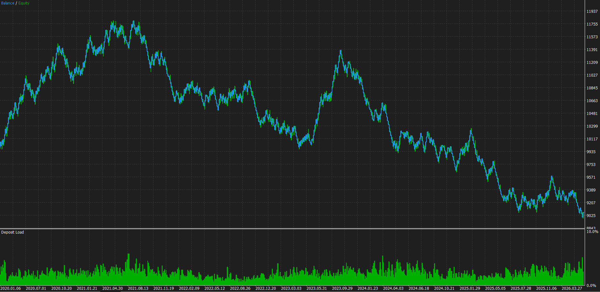

# mql5-expert-advisors

Clean, well-commented MetaTrader 5 Expert Advisors with **real risk management** — the
kind of code I build for clients who want a strategy automated *properly*, not a fixed
0.1-lot toy that blows the account on the first bad streak.

---

## MA_Cross_ATR_EA

An EMA-crossover Expert Advisor written as a reference implementation of *correct* EA
engineering. Every piece a serious automated strategy needs is here, commented line by line:

- **EMA crossover entries** — fast/slow periods configurable
- **ATR-based stop loss** — the stop adapts to current volatility instead of a fixed pip value
- **Risk-based position sizing** — every trade is sized to lose exactly `RiskPercent` of the
  account if the stop is hit. This is the single thing most retail EAs get wrong.
- **Configurable reward:risk take-profit**
- **Daily-loss guard** — stops trading for the day after a set % drawdown (prop-firm friendly)
- **Magic-number isolation** — only manages its own trades; safe to run alongside other EAs
- **Broker-robust lot sizing** — rebuilds tick value from contract size when the platform
  reports it as 0 (a real gotcha in the Strategy Tester's "profit in pips" mode)

### Backtest — transparency note

EURUSD · H1 · 6 years · $10,000 account · 0.5% risk per trade:

The vanilla 20/50 EMA cross is **not a profitable edge** (Profit Factor ≈ 0.96 — it loses
slowly to costs), and it is published that way on purpose. This repo demonstrates the
*engineering* — risk sizing, adaptive stops, daily guards, clean structure — **not** a
magic-money strategy. The edge comes from the client's idea; this is the disciplined
framework I wrap around it and test honestly.

### Inputs

| Input        | Default | Meaning                                      |
|--------------|---------|----------------------------------------------|
| FastMA       | 20      | Fast EMA period                              |
| SlowMA       | 50      | Slow EMA period                              |
| ATRPeriod    | 14      | ATR lookback for the stop                    |
| ATRmultSL    | 2.0     | Stop distance = ATRmultSL × ATR              |
| RewardRisk   | 1.5     | Take-profit = RewardRisk × stop distance     |
| RiskPercent  | 0.5     | % of balance risked per trade                |
| DailyLossPct | 3.0     | Halt trading after this % daily loss         |
| MagicNumber  | 990011  | Trade-isolation tag                          |

### Build & test

Open `MA_Cross_ATR_EA.mq5` in MetaEditor (MT5) and compile with **F7** → `MA_Cross_ATR_EA.ex5`
appears in the Navigator under *Expert Advisors*. Always test in the Strategy Tester before
any live or client use. Set `DebugLog = true` to print every signal and order to the Journal.

---

## Hire me

I build and audit MT5 / MT4 Expert Advisors, strategy backtests, and trading tools. Send me
your strategy and I'll tell you honestly whether it's automatable and how I'd test it.

*Fiverr · Upwork · MQL5 Freelance — links in my profile.*
